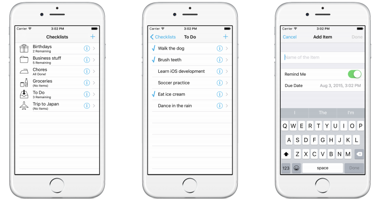

# iOS Apprentice

ios 学徒

- 语言 swift
- [开发工具 xcode](./use_xcode.md)

## 章节内容

通过示范4个demo应用的构建来讲解iOS开发，参考书上第23页的介绍

### 1: Bull's Eye

是一个控制滑块定位的小游戏

### 2: Checklists

一个清单列表

### 3: MyLocations

定位

### 4: StoreSearch

店铺搜索

